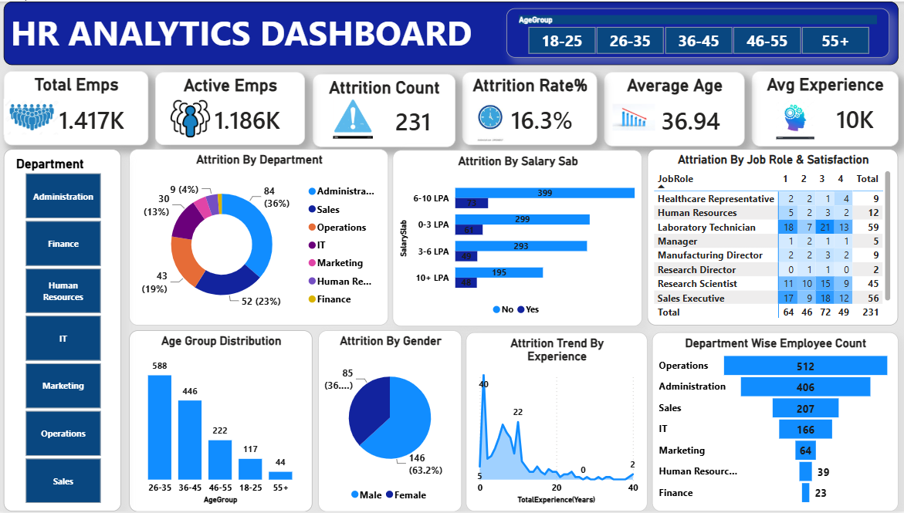

# 📊 HR Analytics Dashboard

An interactive Power BI dashboard designed to analyze employee data and generate valuable HR insights.

This project focuses on employee attrition, workforce distribution, salary analysis, job satisfaction, experience, and departmental performance. The dashboard helps HR teams understand employee behavior and supports data-driven decision-making.

---

## ✨ Dashboard Features

- Employee Attrition Analysis
- Department-Wise Analysis
- Salary-Based Analysis
- Job Role Analysis
- Employee Satisfaction Analysis
- Gender Analysis
- Age Group Analysis
- Experience Analysis
- Interactive Filters and Slicers

---

## 📌 Key Performance Indicators (KPIs)

| KPI | Value |
| --- | --- |
| Total Employees | 1,417 |
| Active Employees | 1,186 |
| Attrition Count | 231 |
| Attrition Rate | 16.3% |
| Average Employee Age | 36.94 Years |
| Average Experience | 10 Years |

---

## 📊 Dashboard Visualizations

- KPI Cards
- Donut Chart
- Bar Charts
- Line Chart
- Matrix Table
- Department Filter
- Age Group Filter
- Employee Distribution Charts

---

## 🔍 Key Insights

- The organization has 1,417 employees.
- The employee attrition rate is 16.3%.
- Employees aged 26–35 represent the largest workforce segment.
- Operations has the highest number of employees.
- Employee attrition varies across different salary levels.
- Job satisfaction has a significant impact on employee retention.

---

## 🛠️ Tools and Technologies

- Power BI
- Power Query
- DAX
- Data Modeling
- Data Visualization
- CSV Dataset

---

## 📂 Project Files

- HR ANALYTICS.pbix
- HR_Analytics.csv
- HR_Dashboard_Screenshot.png
- README.md

---

## 🎯 Business Objectives

- Understand employee turnover.
- Identify high-risk attrition groups.
- Analyze workforce demographics.
- Improve employee retention.
- Support strategic HR decision-making.

---

## 🖼️ Dashboard Preview

---

## 👨‍💻 Author

**Masala Thaslim**

**Aspiring Data Analyst**
